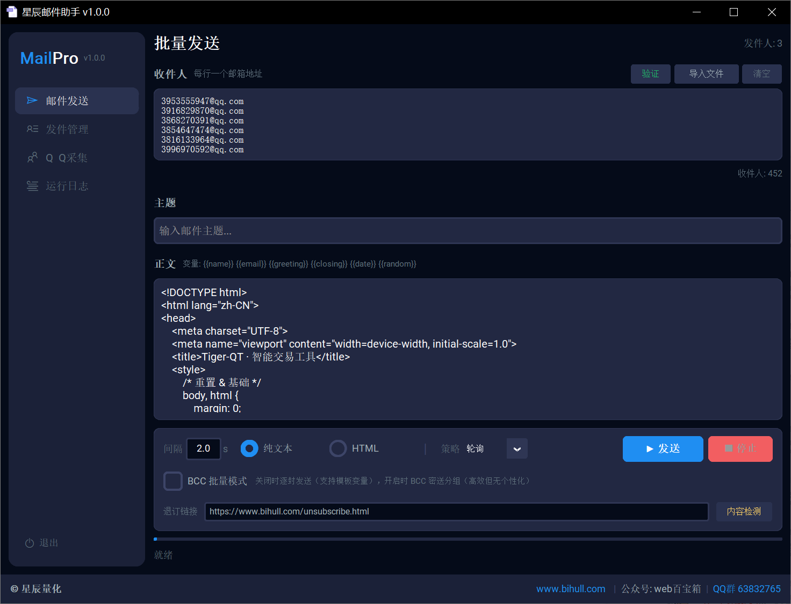
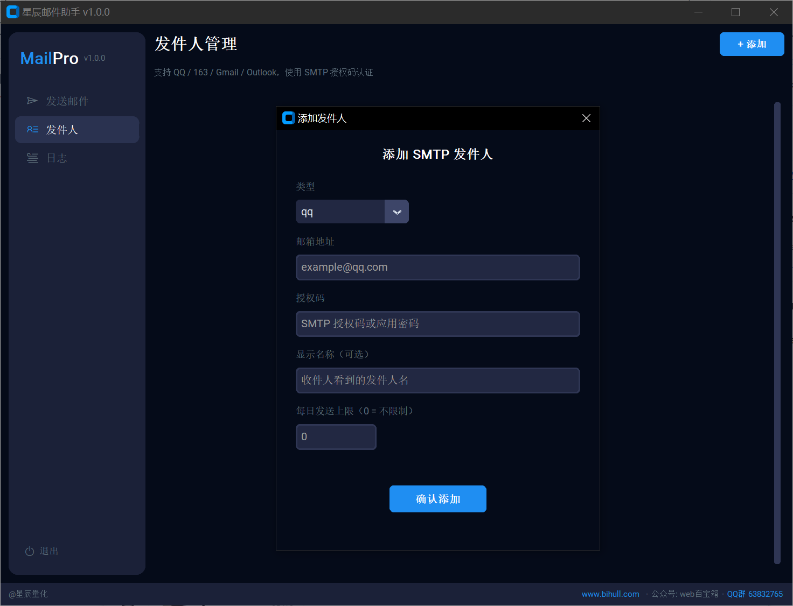
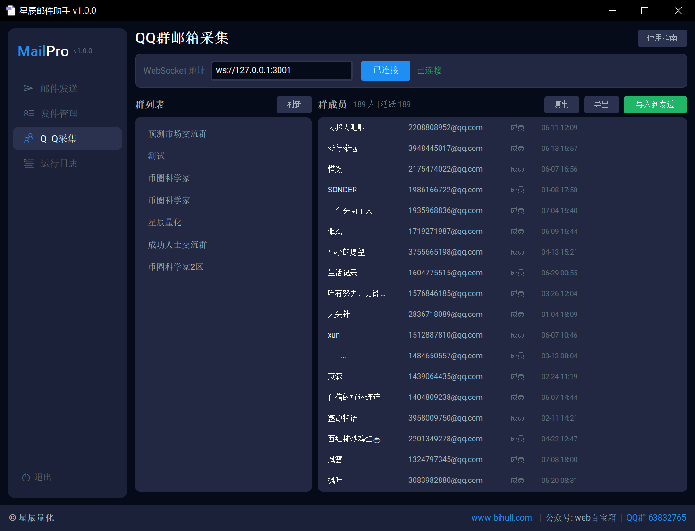
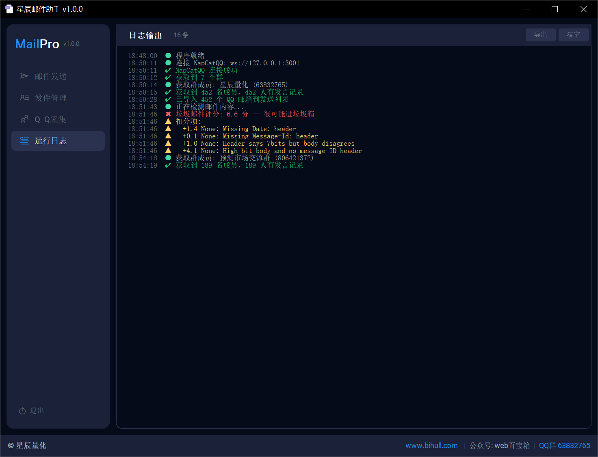

# MailPro 邮件群发助手

高效、安全、可控的邮件群发工具，多发件人轮发 + 反垃圾优化，适用于营销通知、活动推广、客户触达等场景。

## 下载

- **Windows**：下载仓库中的 `MailPro.exe`，双击运行
- **macOS**：暂未提供，敬请期待

## 激活

首次使用需输入激活码。关注微信公众号「**web百宝箱**」，回复「邮件助手」获取。

## 功能特性

### 多平台发送

支持 QQ / 163 / Gmail / Outlook / Hotmail 多邮箱平台 SMTP 发送，多发件人轮询或随机策略分散压力。

### BCC 密送批量模式

一次事务发送多人，大幅提升效率。各平台自动适配分组上限：

| 邮箱 | 建议日限额 | BCC 每组上限 |
|------|-----------|-------------|
| QQ | 200-500 | 50 |
| 163 | 100-200 | 40 |
| Gmail | 500 | 100 |
| Outlook | 300 | 500 |

### 模板个性化

正文和主题支持模板变量，每封邮件内容自动差异化：

- `{{name}}` — 收件人邮箱前缀
- `{{email}}` — 完整邮箱地址
- `{{greeting}}` — 随机问候语
- `{{closing}}` — 随机结尾语
- `{{date}}` — 当前日期
- `{{time}}` — 当前时间

### 反垃圾优化

- 完整邮件头（Message-ID / Date / Reply-To）
- List-Unsubscribe 退订头，主流邮箱显示退订按钮
- 发送间隔随机化，模拟自然行为
- 新发件人自动预热，避免触发风控
- 检测到限频自动降速，保护发件人信誉
- 每个发件人独立配置每日发送上限

### 收件人管理

- 从 TXT / CSV 文件批量导入
- 邮箱格式 + 域名 DNS 预验证
- 自动过滤临时邮箱（一次性邮箱域名）
- 收件人自动去重
- 退信地址自动记录，下次跳过

### 其他功能

- 发送进度条 + 实时日志
- 发送结果导出（CSV）
- 日志导出
- 发件人连接测试
- 发件人编辑 / 删除
- Termius Dark 风格界面

## 使用说明

1. 首次运行输入激活码
2. 在「发件人」页面添加 SMTP 发件人（需要邮箱授权码）
3. 在「发送邮件」页面输入或导入收件人
4. 填写主题和正文（支持 HTML 和模板变量）
5. 选择发送策略和模式，点击发送

## 注意事项

- 请合理使用，遵守相关法律法规
- 建议配置退订链接，降低被投诉风险
- 新发件人先少量发送，逐步提升日发送量
- 批量发送前建议先验证收件人有效性

---

**星辰量化** | [www.bihull.com](https://www.bihull.com) | 公众号：web百宝箱 | QQ群 63832765
